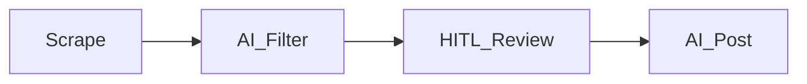

# Speech-M

**방송인 지망생·입시 준비를 위한 채용 정보 올인원 관리 웹앱** — 수집부터 AI 1차 선별, 사람 검수(HITL), 이후 포스팅까지 한 흐름으로 묶는 것을 목표로 합니다.

---

## 왜 만들었나

채용공고는 사이트마다 흩어져 있고, 방송·미디어 직무에 맞는지만 골라내는 데 시간이 많이 듭니다. Speech-M은 **크롤링으로 모은 공고를 DB에** 넣고, **관리자 화면에서 상태·소스별로 필터링**하며, **LLM 기반 job-fit 평가**로 1차 후보를 좁힌 뒤 사람이 최종 판단하는 **“Director’s Eye” 품질 우선** 파이프라인을 코드로 구현한 프로젝트입니다.

## 핵심 파이프라인



1. **Scrape** — 여러 소스에서 채용공고를 수집해 저장합니다.  
2. **AI Filter** — 공고 텍스트에 대한 적합도(job-fit) 판단을 LLM으로 돌릴 수 있는 구조입니다.  
3. **Human-in-the-loop** — 관리자 UI에서 승인·반려·일괄 처리 등으로 검수합니다.  
4. **AI Post** — (도메인상) 검수된 결과를 바탕으로 후속 게시까지 이어지는 설계를 열어 둡니다.

## 기술 스택

| 영역 | 사용 기술 |
|------|-----------|
| 프레임워크 | **Next.js 16** (App Router), **React 19** |
| 언어 | **TypeScript** |
| 스타일 | **Tailwind CSS v4** |
| 데이터 | **Supabase** (`@supabase/ssr`, `@supabase/supabase-js`) |
| 크롤링/파싱 | **Cheerio** |
| 검증·스키마 | **Zod** |
| UI 아이콘 | **Hugeicons** (`@hugeicons/react`) |

## 구현 하이라이트

- **관리자 영역** — `app/(admin)/`: 대시보드, 채용공고 목록·필터·테이블, 크롤 트리거, job-fit 실행 버튼 등 운영자 흐름을 한 곳에 모았습니다.  
- **크롤 API** — `app/api/crawl/*`: 소스별·일괄 동기화 라우트와 공통 트리거 로직(`lib/crawl/`).  
- **Job-fit** — `lib/ai/job-fit/`: 모델·룰·배치 평가, 샘플 골든 메트릭과 벤치마크 API(`app/api/admin/benchmark-job-fit`).  
- **UI 컴포넌트** — `components/admin/`: 사이드바, 테이블, 필터, 크롤/AI 버튼 등 관리자 전용 조각.

## 로컬에서 실행하기

```bash
npm ci
npm run dev
```

브라우저에서 [http://localhost:3000](http://localhost:3000) 을 엽니다.

### 환경 변수 (이름만 안내)

루트에 `.env.local`을 두고 값은 **직접 발급·설정**합니다. 예시 이름은 다음과 같습니다.

- Supabase: `NEXT_PUBLIC_SUPABASE_URL`, `NEXT_PUBLIC_SUPABASE_ANON_KEY`, 서버용 `SUPABASE_SERVICE_ROLE_KEY`  
- 배포 도메인(네이버 공유·OG용 절대 URL): `NEXT_PUBLIC_APP_URL` (예: `https://your-domain.com`) — 미설정 시 로컬은 `http://localhost:3000`, Vercel은 `VERCEL_URL` 기반으로 보완  
- 크롤/관리 API 보호: `CRAWL_API_SECRET`, (스케줄용) `CRON_SECRET`  
- LLM: `OPENAI_API_KEY`, `GEMINI_API_KEY`, 선택 `JOB_FIT_MODEL_OPENAI`, `JOB_FIT_MODEL_GEMINI`  
- 배포/CI 벤치마크 스크립트: `BENCHMARK_BASE_URL`, 선택 `JOB_FIT_METRICS_PATH`

실제 키·URL은 저장소에 커밋하지 마세요.

## Vercel 배포 (실행 체크리스트)

루트 [vercel.json](vercel.json)에 **Cron**(`GET /api/crawl/all`)이 있어 Vercel 배포를 전제로 합니다. Cron 호출은 [app/api/crawl/all/route.ts](app/api/crawl/all/route.ts)에서 `Authorization: Bearer ${CRON_SECRET}`로 검증합니다.

### 1) 프로젝트 연결

1. [Vercel Dashboard](https://vercel.com/dashboard) → **Add New… → Project**.
2. Git 저장소 **Import** (본 프로젝트 `speech-m`).
3. **Framework Preset**: Next.js, **Root Directory**: 저장소 루트.
4. **Production Branch**: 팀 규칙에 맞게 `main` 또는 `dev` 등으로 지정.

### 2) Environment Variables

Vercel **Settings → Environment Variables**에서 Production(필요 시 Preview)에 아래를 등록합니다.

| 변수 | 용도 |
|------|------|
| `NEXT_PUBLIC_SUPABASE_URL` | Supabase 프로젝트 URL |
| `NEXT_PUBLIC_SUPABASE_ANON_KEY` | Supabase anon 키 |
| `SUPABASE_SERVICE_ROLE_KEY` | 서버 전용(관리자·`/jobs/[id]/share` 등). Preview에 넣을지는 팀 정책으로 결정 |
| `NEXT_PUBLIC_APP_URL` | (권장) 공개 사이트 절대 URL. 네이버 공유·OG용으로 [`lib/jobs/site-url.ts`](lib/jobs/site-url.ts)에서 사용. 예: `https://<프로젝트>.vercel.app` 또는 커스텀 도메인 |
| `CRAWL_API_SECRET` | `/api/crawl/*` 호출 시 내부 트리거에 필요 |
| `CRON_SECRET` | Vercel Cron이 `/api/crawl/all` 호출 시 Bearer 검증에 필요 |
| `OPENAI_API_KEY` / `GEMINI_API_KEY` 등 | job-fit 등 LLM 기능 사용 시 |

### 3) 첫 배포 후 확인

1. **Deployments**에서 빌드 로그가 성공인지 확인.
2. **Visit**로 프로덕션 URL 접속.
3. 공개 랜딩 검증: `https://<배포도메인>/jobs/<job-id>/share` — DB에서 해당 행이 **승인(`approved`) + 내부 게시 확정(`published_at` 있음)**이면 200과 본문·메타, 아니면 404([app/jobs/[id]/share/page.tsx](app/jobs/[id]/share/page.tsx)).

### 4) 네이버 공유 E2E

1. 관리자 공고 목록에서 위 조건을 만족하는 행의 네이버 공유 링크 사용([components/admin/jobs-table.tsx](components/admin/jobs-table.tsx)).
2. 네이버 화면에서 제목·요약(스크랩)이 랜딩 페이지 메타와 맞는지 확인.
3. 요약이 기대와 다르면: `NEXT_PUBLIC_APP_URL`이 브라우저 주소창과 일치하는지, 랜딩이 200인지, 배포 환경의 Supabase에 동일 데이터가 있는지 순서로 점검.

### 5) 선택: 커스텀 도메인

Vercel **Domains**에서 도메인 연결 후 DNS가 **Valid**인지 확인하고, `NEXT_PUBLIC_APP_URL`을 `https://<커스텀도메인>`으로 바꾼 뒤 **Redeploy**합니다.

## 스크립트 · 품질

| 명령 | 설명 |
|------|------|
| `npm run lint` | ESLint |
| `npm run build` | 프로덕션 빌드 |
| `npm run bench:job-fit` | 로컬 골든셋 기반 job-fit 배치(환경·키 필요) |
| `npm run check:job-fit-benchmark` | 배포 URL의 벤치마크 API에 메트릭 POST 후 pass/fail (`BENCHMARK_BASE_URL`, `CRAWL_API_SECRET` 필요) |

GitHub Actions에는 job-fit HTTP 검증 워크플로(시크릿이 설정된 경우에만 실제 호출)가 있습니다.
